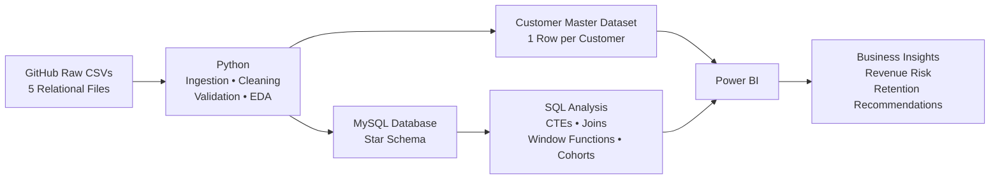
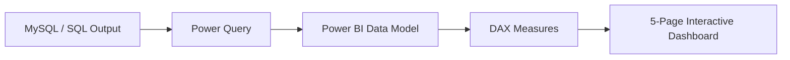

# SaaS Customer Churn, Revenue & Retention Analytics

End-to-end analysis of **customer churn, product engagement, support behavior, recurring revenue, and retention risk** using Python, MySQL, SQL, and Power BI.

Built as an end-to-end business analytics project covering data ingestion, data-quality reconciliation, customer-level data modeling, SQL analysis, Power BI reporting, and retention recommendations.


---

## 1. Business Problem

A B2B SaaS company sells three plan tiers — **Enterprise, Pro, and Basic** — to 500 customers across five industries and five acquisition channels.

Leadership does not have a reliable, single view of:

* **Who is actually still a customer** — the CRM's `churn_flag` and the churn-event log disagree for a large share of accounts.
* **Why customers leave** — whether due to product gaps, support experience, pricing/budget, or plan/channel-specific factors.
* **Which active customers are currently at risk** so Customer Success can intervene before a renewal is lost.
* **How much recurring revenue is exposed** once risk is defined using actual usage and support signals.

This project addresses these questions end to end through data ingestion, data-quality reconciliation, MySQL modeling, SQL analysis, and Power BI reporting.

---

## 2. Business Objectives

The analysis is designed to:

1. Measure customer and revenue churn.
2. Identify churn patterns across plans, industries, acquisition channels, and tenure.
3. Understand recurring revenue and customer value.
4. Identify active customers with elevated retention risk.
5. Analyze product usage and support behavior before churn.
6. Quantify revenue concentration and revenue exposure.
7. Build an interactive Power BI dashboard for stakeholder reporting.
8. Translate analytical findings into actionable retention recommendations.

---

## 3. Dataset

The project uses five relational CSV datasets downloaded programmatically from GitHub.

| Dataset         | Grain                    |   Rows |
| --------------- | ------------------------ | -----: |
| `accounts`      | 1 row per customer       |    500 |
| `subscriptions` | 1 row per subscription   |  5,000 |
| `usage`         | 1 row per usage event    | 25,000 |
| `support`       | 1 row per support ticket |  2,000 |
| `churn`         | 1 row per churn event    |    600 |

### Customer Segments

**Subscription Plans**

* Enterprise
* Pro
* Basic

**Industries**

* DevTools
* FinTech
* Cybersecurity
* HealthTech
* EdTech

**Acquisition Channels**

* Organic
* Ads
* Event
* Partner
* Other

The `churn` table contains event-level records, meaning a customer can appear more than once due to churn, reactivation, and subsequent churn events. The `usage` table is linked to customers through `subscription_id`.

---

## 4. Data Architecture

The project follows an end-to-end analytics pipeline from raw data ingestion to business recommendations.



The workflow connects raw CSVs, Python processing, customer-level modeling, MySQL, SQL analysis, Power BI, and business recommendations.

---

## 5. Data Preparation & Quality Checks

Python is used for:

* Programmatic data ingestion
* Data cleaning
* Missing-value checks
* Duplicate checks
* Primary-key validation
* Referential-integrity checks
* Grain validation
* Customer-level aggregation
* Exploratory data analysis
* Master dataset creation

### Customer-Level Master Dataset

The five source tables have different grains:

| Table           | Grain          |
| --------------- | -------------- |
| `accounts`      | Customer       |
| `subscriptions` | Subscription   |
| `usage`         | Usage Event    |
| `support`       | Support Ticket |
| `churn`         | Churn Event    |

Directly joining these tables can create a **fan-out problem**.

For example:

```text
10 subscriptions
× 50 usage events
× 4 support tickets
= 2,000 rows
```

for a single customer.

This would cause downstream `SUM()` calculations to be incorrectly inflated.

The solution is to aggregate each table to **one row per customer first**, then merge the results onto the `accounts` table.

The final master dataset is validated with an assertion confirming exactly one row per customer.

### Usage Relationship

The `usage` table does not contain `account_id`.

Therefore:

```text
Usage
  ↓
Subscription
  ↓
Customer
```

Usage must first be joined to subscriptions to identify the customer before customer-level aggregation.

---

## 6. Data Quality Reconciliation

A major data-quality issue was identified between:

* `accounts.csv` → `churn_flag`
* `churn.csv` → churn events

The two sources disagree for a meaningful number of customers.

The project treats the **churn events table as the analytical source of truth** because it provides the more detailed event-level record.

This decision is documented and applied consistently throughout the analytical layer.

---

## 7. Data Modeling

After customer-level processing, the data is loaded into a MySQL **star schema**.

### Schema Structure

```text
dim_customer
     |
     +---------------- fact_subscription
     |
     +---------------- fact_usage
     |
     +---------------- fact_support
     |
     +---------------- fact_churn

master_customer_analytics
```

The database contains:

* `dim_customer`
* `fact_subscription`
* `fact_usage`
* `fact_support`
* `fact_churn`
* `master_customer_analytics`

This structure separates customer dimensions from transactional fact tables and provides proper keys, relationships, and referential integrity for analysis.

---

## 8. SQL Analysis

The SQL layer uses MySQL to answer customer, revenue, churn, usage, support, cohort, and risk-related business questions.

### Analytical Techniques

* Joins
* Common Table Expressions
* Aggregations
* Window functions
* `RANK`
* `LAG`
* `NTILE`
* Cohort retention analysis
* Customer risk scoring
* Value-quartile analysis

The SQL analysis covers:

1. Schema and data-quality setup
2. Customer analysis
3. Revenue analysis
4. Churn analysis
5. Usage analysis
6. Support analysis
7. Cohort analysis
8. Lifecycle and customer-risk analysis

The analysis also produces a composite customer risk score and a Top-15 at-risk customer list.

---

## 9. Power BI Dashboard

The final reporting layer is a **5-page interactive Power BI dashboard**.

### Dashboard Pages

| Page                | Focus                                      |
| ------------------- | ------------------------------------------ |
| Executive Overview  | Business KPIs and overall SaaS performance |
| Churn & Retention   | Churn patterns and retention metrics       |
| Customer Health     | Customer engagement and risk indicators    |
| Revenue Risk        | MRR exposure and revenue concentration     |
| Acquisition & Value | Acquisition channels and customer value    |

### Interactive Filters

The dashboard includes synced slicers for:

* Date Range
* Plan
* Industry
* Customer Status
* Acquisition Channel

### Power BI Workflow



Power BI reproduces the same KPI logic used in the SQL layer through DAX measures and calculated columns, keeping the reporting layer consistent with the analytical layer.

---

## 10. Key KPIs

| KPI                         | Definition                                                                                     |
| --------------------------- | ---------------------------------------------------------------------------------------------- |
| **Total MRR**               | Sum of `mrr_amount` for subscriptions with no `end_date`                                       |
| **Active MRR**              | Total MRR scoped to accounts where `is_churned = No`                                           |
| **ARR**                     | Active MRR × 12                                                                                |
| **Active Customers**        | Distinct customers with `is_churned = No`                                                      |
| **Customer Churn Rate**     | Churned customers ÷ total customers                                                            |
| **Revenue Churn Rate**      | MRR from ended subscriptions ÷ total MRR ever billed                                           |
| **ARPU**                    | Active MRR ÷ Active Customers                                                                  |
| **Retention Rate**          | 1 − Customer Churn Rate                                                                        |
| **MRR at Risk**             | Active MRR from customers who are active, in the Low Usage bucket, and have ≥5 support tickets |
| **Revenue Concentration %** | Top-decile MRR ÷ Total MRR                                                                     |

All active metrics are consistently scoped to `is_churned = No` to avoid mixing disputed churn records into active-business KPIs.

---

## 11. Key Findings

### Customer & Revenue

| Metric              |               Result |
| ------------------- | -------------------: |
| Customer Churn Rate |                70.4% |
| Churned Customers   |            352 / 500 |
| Revenue Churn Rate  |                10.4% |
| Total MRR           |          $10,159,608 |
| Active MRR          |           $3,019,740 |
| Active Customers    |                  148 |
| ARPU                |           $20,403.65 |
| ARR                 | Approximately $36.2M |
| MRR at Risk         |             $238,570 |

Customer churn is substantially higher than revenue churn, indicating that churn is concentrated among lower-value accounts.

The difference between Total MRR and Active MRR creates a **$7.14M revenue clarity gap**, because the remaining MRR belongs to accounts with an open churn event but no formally closed subscription.

### Plan Analysis

* Enterprise churn rate: **72.8%**
* Enterprise MRR: **$7.55M**
* Total MRR: **$10.16M**

Enterprise therefore represents the largest concentration of both revenue and observed churn.

### Churn Reasons

| Churn Reason | Share |
| ------------ | ----: |
| Features     | 19.0% |
| Support      | 17.3% |
| Budget       | 17.3% |
| Unknown      | 15.8% |
| Competitor   | 15.3% |
| Pricing      | 15.2% |

No single churn reason dominates the dataset.

### Tenure Analysis

| Customer Tenure | Churn Rate |
| --------------- | ---------: |
| 0–3 months      |      82.9% |
| 3–6 months      |      73.9% |
| 6–12 months     |      71.4% |
| 12+ months      |      53.9% |

Churn decreases steadily as customer tenure increases.

### Customer Value

The highest-value customer quartile has a **76.8% churn rate**, meaning higher historical value does not protect customers from churn in this dataset.

### Acquisition Channel

* Partner churn: **75.3%**
* Ads churn: **60.2%**

### Revenue Concentration

The top 10% of customers by MRR account for **27.4% of total revenue**.

### Product Usage

Usage volume in the months immediately before churn remains roughly flat.

Therefore, usage volume alone does not visibly predict churn in this dataset.

---

## 12. Business Impact

### Revenue Clarity

**$7.14M** of the reported $10.16M Total MRR belongs to accounts whose churn status is disputed between internal sources.

A reliable churn source of truth is therefore required before using the metric for financial reporting.

### Revenue Exposure

Enterprise contributes approximately **74% of Total MRR** while having a **72.8% churn rate**, making plan-level segmentation important for retention analysis.

### Actionable Risk Pool

The **$238.6K MRR-at-Risk** represents a specific group of currently active customers with low usage and high support load.

The Top-15 customer list provides a concrete starting point for Customer Success action.

### Onboarding Opportunity

Churn is highest during the first 3 months at **82.9%** and decreases to **53.9%** for customers with 12+ months of tenure.

### Revenue Concentration

The top 10% of customers represent **27.4% of revenue**, indicating meaningful but not extreme concentration.

### Multiple Churn Drivers

Features, support, and budget are relatively close at **19.0%, 17.3%, and 17.3%**, respectively.

This indicates that retention requires multiple intervention areas rather than a single corrective action.

---

## 13. Retention Recommendations

1. **Reconcile the churn source of truth** before reporting churn KPIs to leadership.
2. Build an **Enterprise-specific retention motion** given its combination of high MRR and high churn.
3. **Front-load onboarding investment** during the first 90 days.
4. Conduct an **account-level review of high-value customer churn**.
5. **Audit the Partner acquisition channel** to understand the high observed churn rate.
6. Build separate retention playbooks for **Support and Budget churn**.
7. Score customer risk using **tenure and support load**, rather than usage volume alone.
8. Use the **$238.6K MRR-at-risk list** as a recurring Customer Success action list.

---

## 14. Project Structure

```text
saas-churn-retention-analytics/
│
├── README.md
├── requirements.txt
│
├── data/
│   ├── raw/
│   └── processed/
│       └── master_customer_analytics.csv
│
├── python/
│   ├── 01_data_ingestion.py
│   ├── 02_data_quality.py
│   ├── 03_master_dataset_builder.py
│   ├── 04_eda.py
│   └── 05_mysql_load.py
│
├── sql/
│   ├── 01_schema.sql
│   ├── 02_data_quality.sql
│   ├── 03_customer_analysis.sql
│   ├── 04_revenue_analysis.sql
│   ├── 05_churn_analysis.sql
│   ├── 06_usage_analysis.sql
│   ├── 07_support_analysis.sql
│   └── 08_cohort_analysis.sql
│
└── screenshots/
```

---

## 15. How to Run

### Step 1 — Install Dependencies

```bash
pip install -r requirements.txt
```

The project requires:

```text
pandas
requests
matplotlib
seaborn
sqlalchemy
pymysql
```

### Step 2 — Download the Data

```bash
python python/01_data_ingestion.py
```

This downloads the five CSV files from GitHub into `data/raw/`.

### Step 3 — Run Data Quality Checks

```bash
python python/02_data_quality.py
```

This checks:

* Missing values
* Duplicate records
* Primary keys
* Referential integrity
* Churn-source inconsistencies

### Step 4 — Build the Master Dataset

```bash
python python/03_master_dataset_builder.py
```

This creates:

```text
data/processed/master_customer_analytics.csv
```

The script validates that the final dataset contains exactly one row per customer.

### Step 5 — Run Python EDA

```bash
python python/04_eda.py
```

This generates five charts in the `screenshots/` directory.

### Step 6 — Create MySQL Database

```sql
CREATE DATABASE IF NOT EXISTS saas_analytics;
```

Update your MySQL credentials in:

```text
python/05_mysql_load.py
```

Then run:

```bash
python python/05_mysql_load.py
```

The script loads:

```text
dim_customer
fact_subscription
fact_usage
fact_support
fact_churn
master_customer_analytics
```

### Step 7 — Run SQL Analysis

Execute the SQL files in order, beginning with:

```text
01_schema.sql
```

followed by the analytical SQL files.

### Step 8 — Build Power BI Dashboard

Connect Power BI to the MySQL database, create the required relationships, implement the DAX measures, and build the five dashboard pages described in the Power BI section.

---

## 16. Limitations

* The dataset is synthetic and intended for portfolio/practice purposes.
* This is an **observational analysis**; associations between churn and other variables do not establish causation.
* `accounts.csv` contains 110 customers flagged as churned, while 352 customers appear in the churn events table.
* The churn events table is treated as the source of truth because it provides event-level detail.
* The discrepancy creates a **$7.14M difference within the $10.16M Total MRR**.
* Active KPIs are consistently scoped to `is_churned = No`.
* Usage contains 42 duplicate `usage_id` values out of 25,000 rows, approximately 0.2%.
* Customer health and MRR-at-risk are analytical frameworks created for this project and are not validated production churn models.
* Results should be validated against real Customer Success data before operational use.

---

## 17. Future Improvements

* Machine-learning churn prediction
* Customer Lifetime Value calculation
* Survival analysis for time-to-churn
* Automated and scheduled data pipelines using tools such as Airflow
* Real-time customer health scoring
* Integration with production Customer Success data

**Author:** Priyanka Lakra
**Role:** Data Analyst
**Portfolio:** [bloomindata.in]
**LinkedIn:** [linkedin.com]
